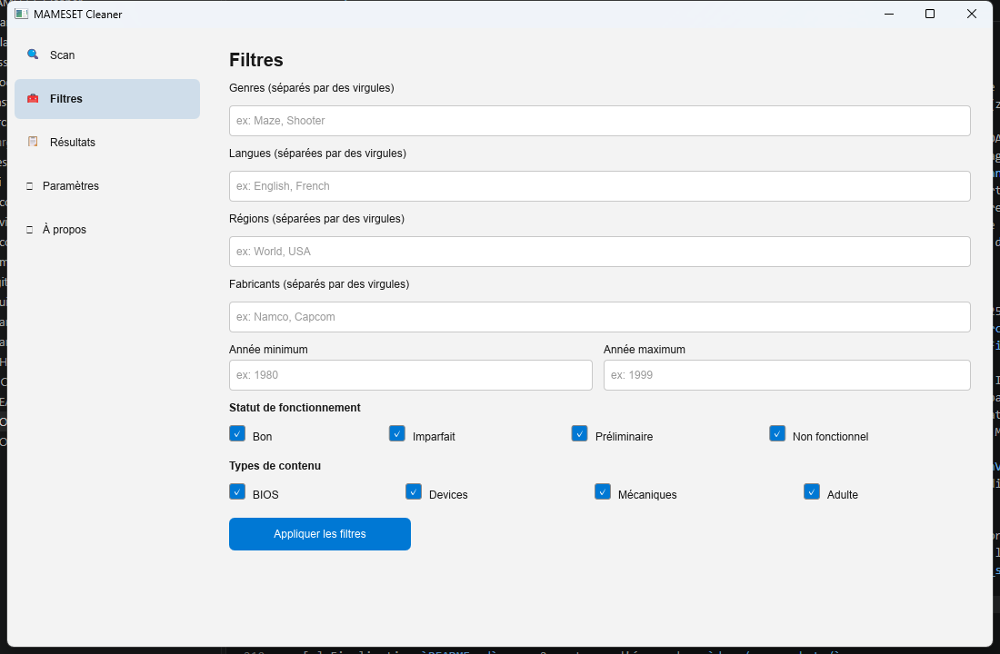
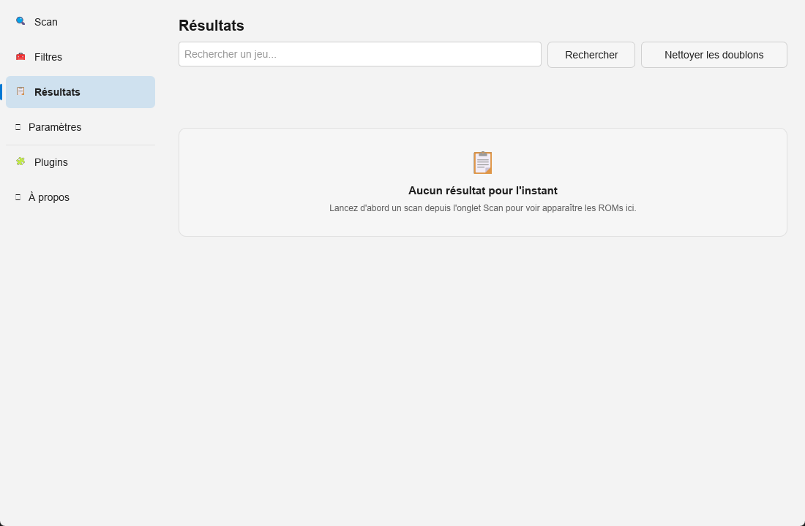

# MAMESET Cleaner

MAMESET Cleaner is a Windows desktop application that helps clean and organize a MAME ROM set: detecting and removing duplicates (clones/parents), filtering by genre, language, region, working status, manufacturer and year, to produce a clean, consistent, minimal ROM set (1 game = 1 ROM).

## Features

- **Scan** the ROM folder (`.zip`, `.7z` files and uncompressed folders), detecting ROMs that are correct, missing, corrupted, or unreferenced
- **Duplicate detection** (1G1R logic: 1 game = 1 ROM) based on a customizable region priority (e.g. World > USA > Europe > Japan), working status and the most recent revision
- **Filtering** by genre, language, region, working status, manufacturer, year and content type (BIOS, mechanical, adult)
- **Cleanup** of duplicate ROMs: moved to the Windows Recycle Bin by default (or permanently deleted), with an optional backup beforehand and mandatory confirmation before any deletion
- **Detailed report** for every cleanup operation (JSON and CSV)
- **Automatic integrity check** of the set after a cleanup
- **French and English** interface, **light and dark** theme
- **Multi-console plugin system**: beyond its native MAME support, the application can load a plugin to clean ROM sets for other consoles. Support for several Nintendo and Sega systems is in active development and will become available for download from the in-app "Plugins" section as each one is published

## Installation

A Windows installer (Inno Setup) is available from version v1.0.0 onward. See the [releases](https://github.com/Patrickjaillet/MAMESET-Cleaner/releases) of this repository.

The application runs on Windows 10 and Windows 11 (64-bit).

## Building from source

See [docs/COMPILATION.md](docs/COMPILATION.md).

## License

This software is distributed under the **MIT** license. See the [LICENSE](LICENSE) file.

## Contact

- Email: sandefjord.development@proton.me
- Website: https://patrickjaillet.github.io/MAMESET-Cleaner
